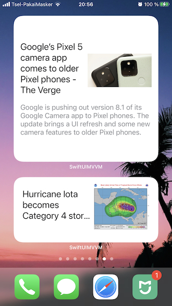

# SwiftUI with MVVM

Simple SwiftUI App demonstrates lists of US news (thanks https://newsapi.org/).
Webkit for detailed news view.
Update: add WidgetKit and shared container.

### Usage:
* `WebKit`
* `SwiftUI`
* `WidgetKit`
* `MVVM pattern`
* `Network services`

